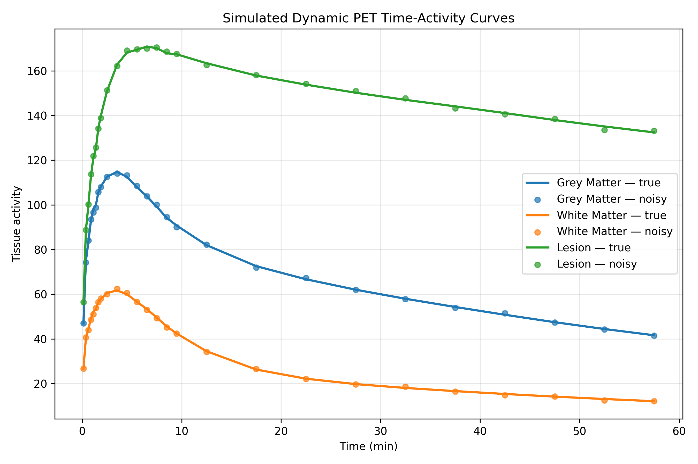
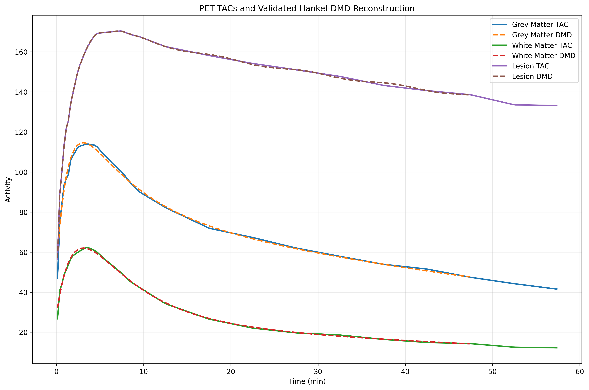
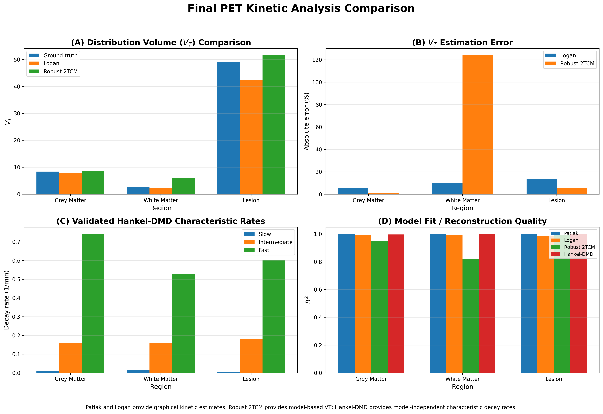

# Model-Independent Kinetic Analysis of Dynamic PET via Hankel-DMD

**A data-driven framework for characterizing dynamic PET time-activity curves (TACs) using Hankel Dynamic Mode Decomposition (Hankel-DMD).**

This project investigates whether Hankel-DMD can provide a **model-independent characterization of PET tracer dynamics** without explicitly imposing a compartmental kinetic model during the DMD analysis.

Simulated dynamic PET TACs are generated using a reversible **two-tissue compartment model (2TCM)** and subsequently analyzed using:

- Hankel-DMD
- nonlinear 2TCM fitting
- Logan graphical analysis
- Patlak graphical analysis

> **Core idea:** 2TCM is used to generate synthetic PET data with known ground-truth kinetics. Hankel-DMD then analyzes the resulting TACs directly from their temporal structure, without using the compartmental equations as the DMD model.

---

## Motivation

Dynamic PET provides time-resolved measurements of radiotracer activity and therefore contains information about tracer delivery, distribution, retention, and clearance.

Conventional PET kinetic analysis generally relies on predefined compartmental or graphical models.

This project explores a complementary approach:

> **Can the temporal dynamics of a PET TAC be characterized directly from the observed time series using a data-driven dynamical-systems method?**

Hankel-DMD combines delay embedding with Dynamic Mode Decomposition to extract characteristic temporal dynamics from the TAC.

The project also explores the transfer of a Hankel-DMD / Koopman time-series framework to PET kinetic analysis.

---

## Objectives

- Simulate dynamic PET TACs using a reversible 2TCM.
- Incorporate PET-like frame averaging and signal-dependent noise.
- Apply Hankel-DMD without imposing the underlying compartmental model.
- Extract slow, intermediate, and fast characteristic temporal rates.
- Benchmark the DMD representation against conventional PET kinetic approaches.

---

# Pipeline

```text
┌──────────────────────────────┐
│   2-Tissue Compartment Model  │
│      + Arterial Input        │
└──────────────┬───────────────┘
               │
               ▼
┌──────────────────────────────┐
│     Dynamic PET Simulation    │
│  Frame averaging + noise      │
└──────────────┬───────────────┘
               │
               ▼
┌──────────────────────────────┐
│       PET TAC Processing      │
│     Uniform temporal grid     │
└──────────────┬───────────────┘
               │
               ▼
┌──────────────────────────────┐
│          Hankel-DMD           │
│     Delay embedding + DMD     │
└──────────────┬───────────────┘
               │
       ┌───────┴────────┐
       ▼                ▼
┌─────────────┐  ┌─────────────────┐
│ DMD Modes   │  │ Temporal Rates  │
│             │  │ Slow / Int. /   │
│             │  │ Fast            │
└─────────────┘  └─────────────────┘
               │
               ▼
┌──────────────────────────────┐
│     Conventional Analysis     │
├────────────┬────────┬────────┤
│    2TCM    │ Logan  │ Patlak │
└────────────┴────────┴────────┘
               │
               ▼
┌──────────────────────────────┐
│       Cross-method Analysis   │
└──────────────────────────────┘
````
# Methodology
````
## 1. Dynamic PET Simulation

Dynamic PET TACs are generated using a reversible two-tissue compartment model (2TCM).

The tissue compartments follow:

$$
\frac{dC_1}{dt} = K_1 C_p-(k_2+k_3)C_1+k_4C_2
$$

$$
\frac{dC_2}{dt} = k_3C_1-k_4C_2
$$

where:

- $C_p(t)$ = arterial plasma input function
- $C_1(t)$ = first tissue compartment
- $C_2(t)$ = second tissue compartment
- $K_1$ = plasma-to-tissue transport rate
- $k_2$ = tissue-to-plasma transport rate
- $k_3$ = forward exchange rate into the second compartment
- $k_4$ = reverse exchange rate

The measured tissue activity is:

$$
C_t(t)
=
(1-v_B)(C_1+C_2)+v_BC_p
$$

where $v_B$ represents the blood-volume fraction.

### Simulated Regions

| Region | $K_1$ | $k_2$ | $k_3$ | $k_4$ | $v_B$ |
|---|---:|---:|---:|---:|---:|
| Grey matter | 0.300 | 0.250 | 0.120 | 0.020 | 0.050 |
| White matter | 0.150 | 0.200 | 0.050 | 0.020 | 0.030 |
| Lesion | 0.350 | 0.150 | 0.200 | 0.010 | 0.060 |

The ground-truth total distribution volume is:

$$
V_T
=
\frac{K_1}{k_2}
\left(
1+\frac{k_3}{k_4}
\right)
$$

giving:

| Region | Ground-truth $V_T$ |
|---|---:|
| Grey matter | 8.400 |
| White matter | 2.625 |
| Lesion | 49.000 |

---

## 2. PET Frame Simulation

The continuous TACs are converted into discrete PET measurements using a non-uniform dynamic PET frame schedule.

The simulation includes:

- bi-exponential arterial input function
- PET frame averaging
- signal-dependent noise
- three simulated tissue regions
- 26 PET frames
- acquisition range of approximately 0–60 min

Before Hankel-DMD, the TACs are interpolated onto a uniform temporal grid required by the current DMD implementation.

---

## 3. Hankel-DMD

Hankel-DMD uses delay embedding to represent the TAC as a higher-dimensional dynamical system.

For a TAC $x(t)$, a Hankel matrix is constructed as:

$$
H=
\begin{bmatrix}
x_1 & x_2 & x_3 & \cdots \\
x_2 & x_3 & x_4 & \cdots \\
x_3 & x_4 & x_5 & \cdots \\
\vdots & \vdots & \vdots & \ddots
\end{bmatrix}
$$

DMD is then applied to the delay-embedded representation.

### DMD Outputs

- selected DMD rank
- reconstruction $R^2$
- normalized RMSE
- slow characteristic rate
- intermediate characteristic rate
- fast characteristic rate

### Interpretation

The DMD rates are treated as **data-driven temporal descriptors**.

They are not assumed to be direct estimates of:

- $K_1$
- $k_2$
- $k_3$
- $k_4$
- $V_T$
- Patlak $K_i$

Therefore, DMD and conventional PET kinetic methods are used as **complementary analyses**, rather than as methods estimating the same parameter.

---

# Results

## Hankel-DMD Results

The validated Hankel-DMD analysis produced:

| Region | Rank | $R^2$ | NRMSE | Slow | Intermediate | Fast |
|---|---:|---:|---:|---:|---:|---:|
| Grey matter | 3 | 0.9963 | 0.0175 | 0.0124 | 0.1605 | 0.7415 |
| White matter | 3 | 0.9986 | 0.0114 | 0.0143 | 0.1601 | 0.5286 |
| Lesion | 11 | 0.9986 | 0.0045 | 0.0043 | 0.1804 | 0.6032 |

The Hankel-DMD representation reconstructs the simulated TACs with high $R^2$ across all three regions.

The extracted characteristic rates provide a compact description of different temporal components of the simulated TACs.

---

# Conventional Kinetic Analysis

## 2TCM Fitting

Multi-start nonlinear least-squares fitting gives:

| Region | True $V_T$ | Fitted $V_T$ | Error |
|---|---:|---:|---:|
| Grey matter | 8.400 | 8.470 | 0.84% |
| White matter | 2.625 | 5.879 | 123.97% |
| Lesion | 49.000 | 51.553 | 5.21% |

The grey-matter and lesion fits recover the simulated $V_T$ relatively closely.

The white-matter fit shows a substantial discrepancy between fitted and ground-truth $V_T$, demonstrating sensitivity of nonlinear compartmental parameter estimation under the simulated conditions.

---

## Logan Analysis

Logan graphical analysis estimates total distribution volume $V_T$:

| Region | True $V_T$ | Logan $V_T$ | Error |
|---|---:|---:|---:|
| Grey matter | 8.400 | 7.952 | 5.34% |
| White matter | 2.625 | 2.359 | 10.12% |
| Lesion | 49.000 | 42.516 | 13.23% |

---

## Patlak Analysis

Patlak graphical analysis provides the net influx parameter $K_i$:

| Region | Patlak $K_i$ (1/min) | $R^2$ |
|---|---:|---:|
| Grey matter | 0.05063 | 0.999760 |
| White matter | 0.01488 | 0.999912 |
| Lesion | 0.16252 | 0.999996 |

Because the simulated 2TCM is reversible ($k_4>0$), Patlak is treated here as a **comparative graphical analysis** rather than a direct ground-truth estimator of the reversible 2TCM parameters.

---

# Summary Comparison

| Region | True $V_T$ | Patlak $K_i$ | Logan $V_T$ | Logan Error | 2TCM $V_T$ | 2TCM Error | DMD Rank |
|---|---:|---:|---:|---:|---:|---:|---:|
| Grey matter | 8.400 | 0.05063 | 7.952 | 5.34% | 8.470 | 0.84% | 3 |
| White matter | 2.625 | 0.01488 | 2.359 | 10.12% | 5.879 | 123.97% | 3 |
| Lesion | 49.000 | 0.16252 | 42.516 | 13.23% | 51.553 | 5.21% | 11 |

> **Note:** Patlak $K_i$, Logan/2TCM $V_T$, and DMD rates are different kinetic/dynamical quantities and should not be compared as if they were equivalent parameters.

---

# Key Findings

## Hankel-DMD

- High reconstruction accuracy across all simulated regions.
- $R^2 > 0.996$ for all three TACs.
- Distinct slow, intermediate, and fast temporal components were identified.
- The DMD representation does not require the 2TCM equations during the DMD analysis.

## Conventional Kinetic Analysis

- 2TCM recovered $V_T$ accurately for grey matter and lesion.
- The white-matter 2TCM fit showed a large $V_T$ error.
- Logan provided $V_T$ estimates with 5–13% error in these simulations.
- Patlak produced highly linear graphical fits for the selected fitting interval.

## Overall

Hankel-DMD provides a **high-fidelity, model-independent representation of the temporal dynamics** of the simulated PET TACs.

The current results do not establish DMD as a replacement for conventional PET kinetic modelling. Instead, they demonstrate its potential as a **complementary data-driven dynamical analysis and feature-extraction framework**.

Figures
Simulated Dynamic PET TACs

Hankel-DMD Decomposition

Conventional Kinetic Comparison

# Figures

### Simulated Dynamic PET TACs



### Hankel-DMD Decomposition



### Conventional Kinetic Comparison



---

# Project Structure

```text
PET/
│
├── README.md
├── LICENSE
├── .gitignore
├── requirements.txt
│
├── src/
│   ├── simulate_pet_tac.py
│   ├── patlak_baseline.py
│   ├── logan_baseline.py
│   ├── validate_2tcm_model.py
│   ├── dmd_kinetic_analysis.py
│   ├── final_pet_kinetic_comparison.py
│
├── data/
│   └── *.npz
│
└── figures/
    └── *.png
```

---

# Installation

Clone the repository:

```bash
git clone https://github.com/YOUR-USERNAME/pet-dmd-kinetics.git
cd pet-dmd-kinetics
```

Install the dependencies:

```bash
pip install -r requirements.txt
```

### Requirements

```text
numpy
scipy
matplotlib
```

---

# Usage

Run the complete pipeline:

```bash
python src/run_all.py
```

Or execute the individual stages:

```bash
python src/simulate_pet_tac.py
python src/patlak_baseline.py
python src/logan_baseline.py
python src/validate_2tcm_model.py
python src/dmd_kinetic_analysis.py
python src/final_pet_kinetic_comparison.py
```

The pipeline generates the simulated PET data, performs conventional kinetic analyses, applies Hankel-DMD, and produces the final comparison.

---

# Limitations

This is a **computational proof-of-concept**, not a clinically validated PET analysis method.

Current limitations include:

- Simulated rather than patient PET data
- Limited number of tissue regions
- Prescribed arterial input function
- Reversible 2TCM used for data generation
- Interpolation onto a uniform temporal grid for Hankel-DMD
- DMD rates have not been established as direct physiological biomarkers
- No voxelwise or parametric PET analysis
- No uncertainty quantification of DMD-derived rates
- Limited evaluation of robustness across different noise levels and acquisition protocols

Therefore, the results should not be interpreted as demonstrating clinical superiority of DMD over established PET kinetic methods.

---

# Future Work

Potential extensions include:

- Validation using real dynamic PET datasets
- Voxelwise Hankel-DMD analysis
- Patient-specific arterial input functions
- Uncertainty quantification of DMD modes and rates
- Evaluation across multiple noise levels
- Comparison across different PET tracers
- Investigation of relationships between DMD descriptors and established kinetic biomarkers
- Integration of DMD features with conventional kinetic modelling
- Investigation of DMD as a preprocessing or quality-control tool for PET kinetic analysis

---

# Scientific Perspective

This project explores the transfer of **data-driven dynamical-systems methods** to quantitative PET.

Conventional kinetic analysis begins with a predefined model of tracer behaviour.

Hankel-DMD instead begins with the observed temporal signal and seeks a compact representation of its underlying dynamics.

The long-term objective is to investigate whether such model-independent dynamical representations can complement conventional PET kinetic modelling and provide additional information for quantitative imaging analysis.

---

# Reproducibility

All simulated PET data are generated programmatically.

Generated `.npz` files are excluded from version control because they can be regenerated from the source code.

The repository contains the analysis pipeline and selected figures required to reproduce and inspect the computational study.

---

# Author

**Aindrila Paul Chowdhury**  
M.Sc. Medical Physics, IIT Hyderabad

---

# License

This project is released under the **MIT License**.
